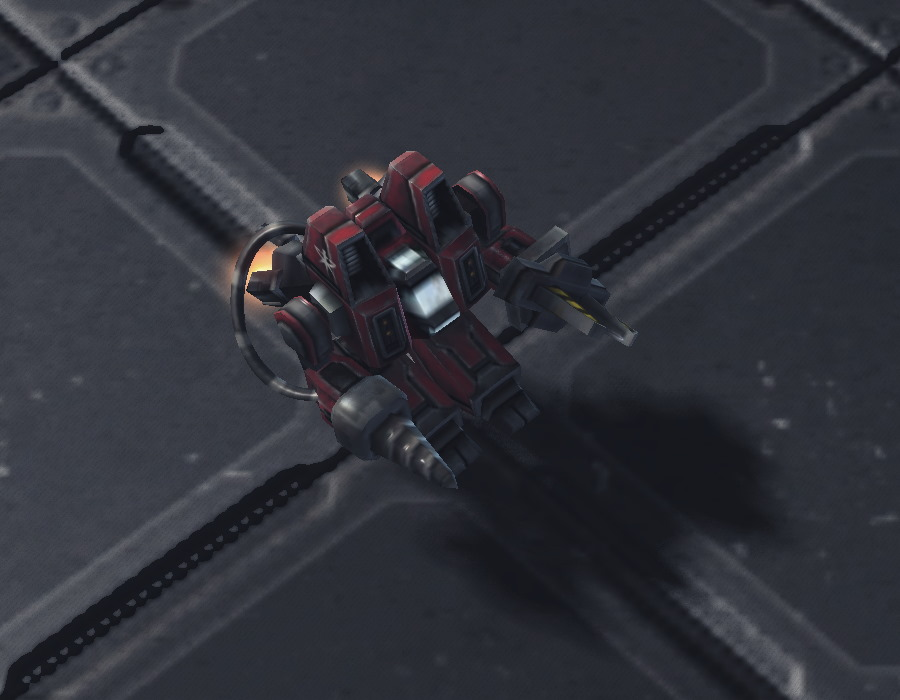

# SCV Code

<p align="center">
  
</p>

StarCraft SCV sound effects for [Claude Code](https://claude.ai/code). Transform your coding sessions with iconic SCV voice lines from StarCraft.

## What It Does

This adds sound effects to Claude Code hook events:

| Event | Sound |
|-------|-------|
| Session start | Random start lines (includes "SCV reportin' for duty", "SCV ready!") |
| Prompt submit | Random confirmation lines ("Affirmative", "Roger that", "Will do", etc.) |
| File read | Mining sound |
| File write | Random work pool (SCV work chatter + classic work sounds) |
| Bash success | Random work pool (SCV work chatter + classic work sounds) |
| Bash error | Random error pool ("Nuclear launch detected", build/error voice lines) |
| Notifications | Random question lines ("Orders, captain?", "Huh?", "What's goin' on?", etc.) |
| Session end | Random: "Job's finished", "SCV good to go, sir" |

## Quick Install

```bash
git clone git@github.com:r-khr/scv-code.git
cd scv-code
./install.sh
```

## Requirements

- **Claude Code** CLI installed
- **jq** - JSON processor for merging settings
- **Audio player**:
  - macOS: `afplay` (built-in)
  - Linux: `paplay` (PulseAudio) or `aplay` (ALSA)

### Installing jq

```bash
# macOS
brew install jq

# Debian/Ubuntu
sudo apt install jq

# Fedora
sudo dnf install jq

# Arch
sudo pacman -S jq
```

### Installing audio player (Linux)

```bash
# PulseAudio (recommended)
sudo apt install pulseaudio-utils

# ALSA
sudo apt install alsa-utils
```

## Manual Installation

If you prefer to install manually:

1. **Copy sounds** to `~/.claude/sounds/`:
   ```bash
   mkdir -p ~/.claude/sounds
   cp -r sounds/* ~/.claude/sounds/
   ```

2. **Edit hooks.json** - Replace `{{PLAYER}}` with your audio player:
   - macOS: `afplay`
   - Linux: `paplay` or `aplay`

3. **Merge hooks** into `~/.claude/settings.json`:
   ```bash
   # If settings.json doesn't exist:
   cp hooks.json ~/.claude/settings.json

   # If it exists, merge the hooks section using jq:
   jq -s '.[0] * {hooks: .[1].hooks}' ~/.claude/settings.json hooks.json > temp.json
   mv temp.json ~/.claude/settings.json
   ```

## Customization

### Adding Your Own Sounds

Add `.wav` or `.mp3` files to the appropriate directory:

```
~/.claude/sounds/
├── starting/     # Session start sounds
├── confirmed/    # Prompt confirmation sounds
├── done/         # Session end sounds
├── question/     # Notification sounds
├── work/         # File write + bash success random pool
├── error/        # Bash error random pool
├── mining.wav    # File read sound
├── nuclear_launch_detected.wav  # Legacy error sound (also in error pool)
└── edrrep0*.wav  # Legacy work sounds (also in work pool)
```

The installer picks random sounds from directories with multiple files.

### Disabling Specific Hooks

Edit `~/.claude/settings.json` and remove the hook events you don't want:

```json
{
  "hooks": {
    "SessionStart": [...],  // Remove this line to disable
    "UserPromptSubmit": [...],
    // etc.
  }
}
```

## Uninstall

```bash
# Remove sounds
rm -rf ~/.claude/sounds

# Remove hooks from settings (keeps other settings intact)
jq 'del(.hooks)' ~/.claude/settings.json > temp.json && mv temp.json ~/.claude/settings.json
```

## Sound Credits

All sounds are from StarCraft by Blizzard Entertainment. This project is for personal use and is not affiliated with Blizzard Entertainment.

## License

MIT
